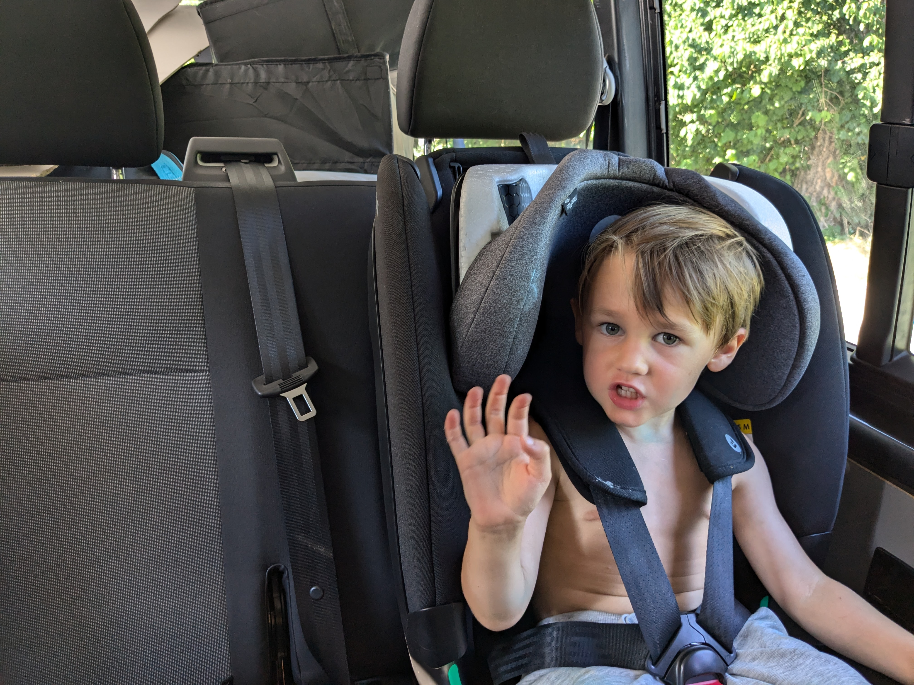
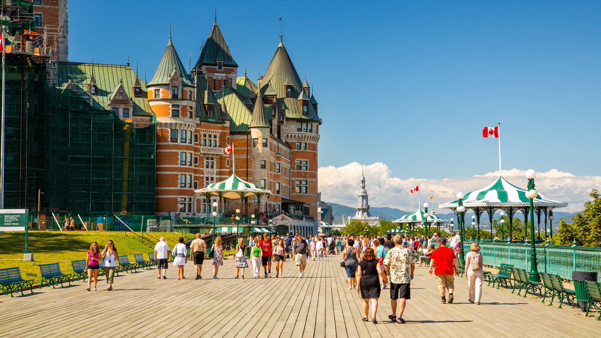
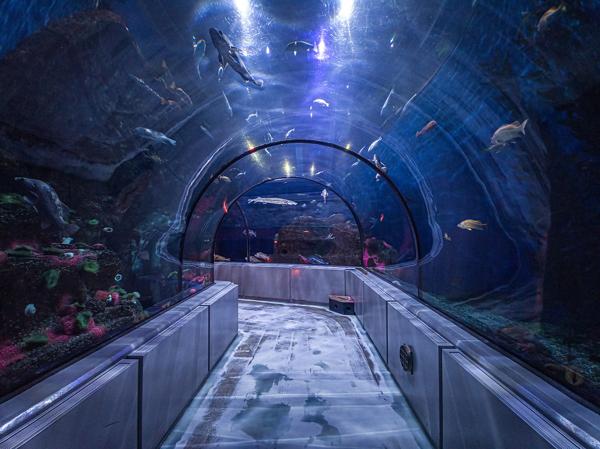
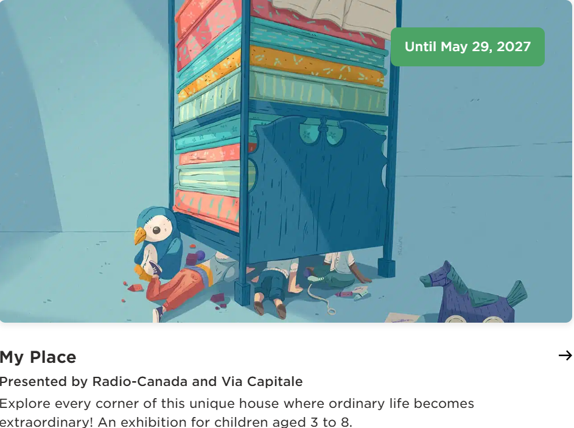
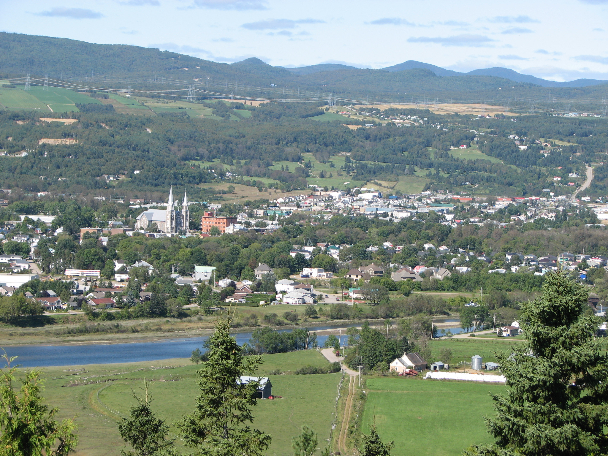
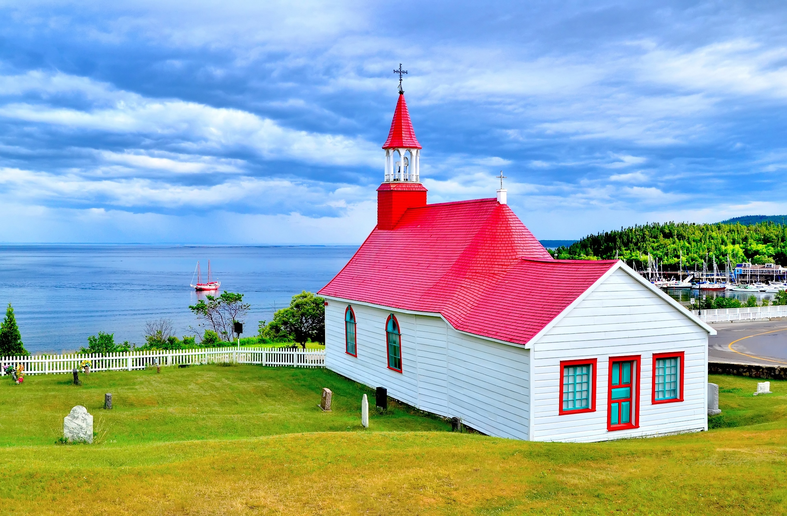
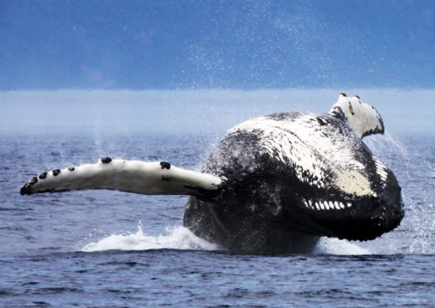

## 🗺️ Unsere Route

**Route:** Fredericton → Rivière-du-Loup → Québec City → Baie-Saint-Paul → Tadoussac → Rückfahrt

<iframe src="https://www.google.com/maps/embed?pb=!1m58!1m12!1m3!1d1791982.1431162334!2d-70.56028174688397!3d46.88208132678919!2m3!1f0!2f0!3f0!3m2!1i1024!2i768!4f13.1!4m43!3e0!4m5!1s0x4cbcd0e8c643a6df%3A0x8667f9153f5eddf5!2sGrand%20Falls%2C%20New%20Brunswick!3m2!1d47.0455087!2d-67.7448517!4m5!1s0x4cbe47536cff8173%3A0x411def4a6db028a1!2zUml2acOocmUtZHUtTG91cCwgUXXDqWJlYw!3m2!1d47.831243699999995!2d-69.5360187!4m5!1s0x4cb8968a05db8893%3A0x8fc52d63f0e83a03!2sQuebec%20City%2C%20QC!3m2!1d46.8130816!2d-71.20745959999999!4m5!1s0x4cbf11355f4ddb17%3A0x88c1ed172b087ea8!2sBaie-Saint-Paul%2C%20Qu%C3%A9bec!3m2!1d47.441167!2d-70.5053937!4m5!1s0x4cbfd5c05f904ecb%3A0x1343833432cb9559!2sTadoussac%2C%20Qu%C3%A9bec!3m2!1d48.145977599999995!2d-69.7128395!4m5!1s0x4cbe47536cff8173%3A0x411def4a6db028a1!2zUml2acOocmUtZHUtTG91cCwgUXXDqWJlYw!3m2!1d47.831243699999995!2d-69.5360187!4m5!1s0x4ca4220ba498fb2b%3A0xe7de2f297a415db4!2sFredericton%2C%20New%20Brunswick!3m2!1d45.9635895!2d-66.6431151!5e0!3m2!1sde!2sca!4v1756229913432!5m2!1sde!2sca" 
  width="100%" height="450" style="border:0;" allowfullscreen="" 
  loading="lazy">
</iframe>

---

## Tag 1 – Sonntag, 31. August
Abfahrt Fredericton Richtung Rivière-du-Loup (ca. 5,5 h). Stopp an den Grand Falls Gorge — Wasserfall und kurze Wanderung. Abends Spaziergang im Parc de la Pointe.

## Tag 2 – Montag, 1. September
Fahrt nach Québec City (ca. 2,5 h). Nachmittags Altstadt bummeln: Petit Champlain, Place Royale. Abends auf der Dufferin Terrace — Promenade und Eis essen 🍦

## Tag 3 – Dienstag, 2. September
Aquarium du Québec 🐟 und nachmittags Parc de la Chute-Montmorency mit Seilbahn und Hängebrücke.

## Tag 4 – Mittwoch, 3. September
Musée de la civilisation — interaktive Ausstellungen, perfekt für Kinder. Nachmittags Plains of Abraham und Citadelle.

## Tag 5 – Donnerstag, 4. September
Freier Vormittag, dann Abfahrt nach Baie-Saint-Paul (ca. 1 h). Spaziergang durch das kleine Künstlerstädtchen.

## Tag 6 – Freitag, 5. September
Train de Charlevoix 🚂 von Baie-Saint-Paul nach La Malbaie. Nachmittags Weiterfahrt nach Tadoussac.

## Tag 7 – Samstag, 6. September
Marine Mammal Interpretation Centre und nachmittags [Whale Watching Tour](https://voyagesaml.com/en/tadoussac/) — ca. 3 Stunden auf dem Wasser 🐋. Abends zu den Sanddünen.

## Tag 8 – Sonntag, 7. September
Fähre Saint-Siméon → Rivière-du-Loup ⛴️, dann weiter bis Edmundston. Stopp im New Brunswick Botanical Garden 🌸

## Tag 9 – Montag, 8. September
Rückfahrt Edmundston → Fredericton (ca. 3,5 h). Ankunft am Nachmittag.

---

## Fazit
Eine unvergessliche Familienreise. Beeindruckende Naturwunder, spannende Aktivitäten für Kinder und die kulinarischen Highlights Québecs — diese Route bietet eine perfekte Mischung aus Abenteuer und Entspannung.